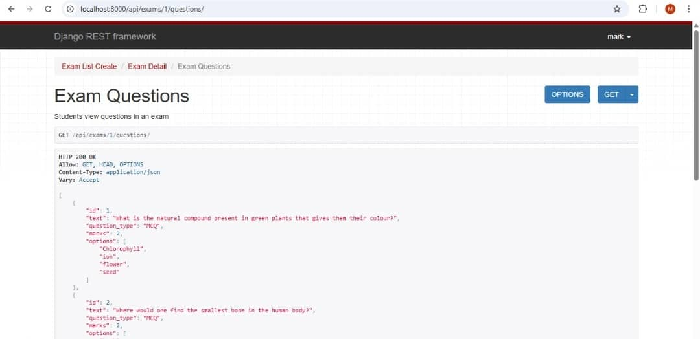
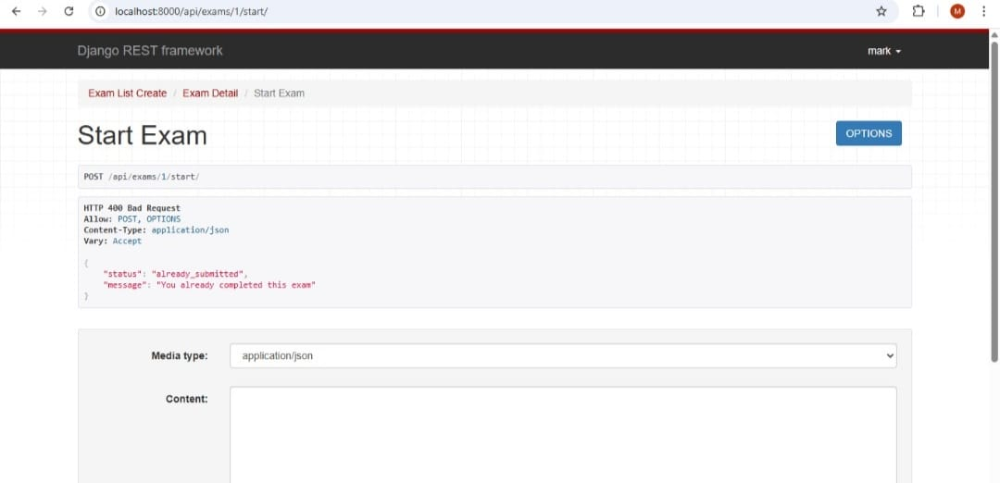
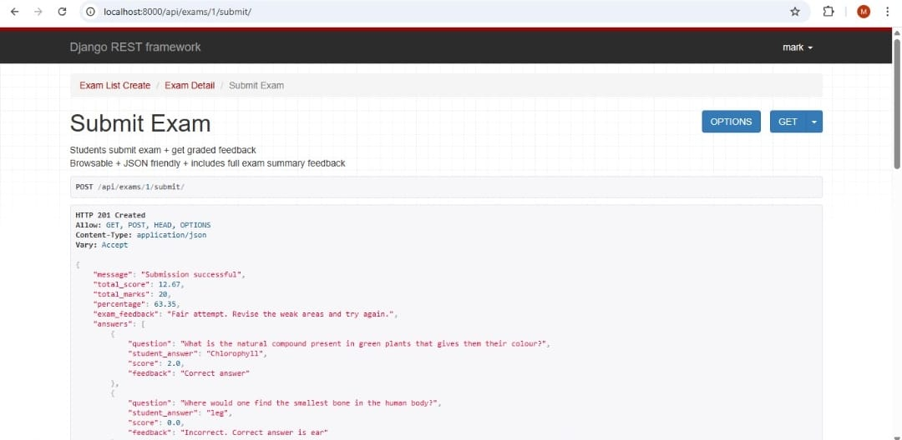

## ACAD AI  MINI ASSESSMENT ENGINE API

Acad_AI is a Django REST API that allows staff/admin to create exams and questions, while students can register, take exams, submit answers, and receive automatic grading and feedback.

This project demonstrates strong backend engineering, authentication security, structured API workflow, intelligent keyword-based grading, and a professional assessment engine design suitable for real educational systems.

------------------------------------------------------------
FEATURES
------------------------------------------------------------
- Staff/Admin can create and manage exams
- Students can register, login, and take exams
- Supports MCQ and Theory questions
- Fully usable via Browser and Postman
- JWT Authentication
- Prevents duplicate submissions
- Timed exam support
- Intelligent keyword-based theory grading
- SQLite database ready to use
- Detailed performance feedback
- Stable and safe error handling


------------------------------------------------------------
TECH STACK
------------------------------------------------------------
Python
Django
Django REST Framework
JWT Authentication
SQLite Database


------------------------------------------------------------
PROJECT SETUP
------------------------------------------------------------
Clone Repository
----------------
```bash
git clone https://github.com/Markmang/Acad_AI.git
cd Acad_AI
```

Create Virtual Environment
--------------------------
```bash
python -m venv venv
```

Activate Virtual Environment
----------------------------
Windows:
```bash
venv\Scripts\activate
```

Mac/Linux:
```bash
source venv/bin/activate
```

Install Dependencies
--------------------
```bash
pip install -r requirements.txt
```

Run Migrations
--------------
```bash
python manage.py migrate
```

Start Server
------------
```bash
python manage.py runserver
```

Server URL:
```
http://localhost:8000
```


------------------------------------------------------------
DATABASE
------------------------------------------------------------
SQLite database is included.
No extra configuration needed.


------------------------------------------------------------
AUTHENTICATION SYSTEM
------------------------------------------------------------
Uses JWT Authentication.
Protected endpoints cannot be accessed without login.


------------------------------------------------------------
USER TYPES
------------------------------------------------------------
SUPERUSER / STAFF CAN:
- Login to Django Admin
- Create Exams
- Create MCQ and Theory Questions
- Manage exam data

STUDENTS CAN:
- Register
- Login
- View assigned exams
- Start exams
- Submit exams
- Receive grading feedback


------------------------------------------------------------
SCREENSHOTS
------------------------------------------------------------
| Questions List | Start Exam | Submit Success |
|----------------|------------|----------------|
|  |  |  |


------------------------------------------------------------
REGISTRATION & LOGIN (BROWSABLE API)
------------------------------------------------------------
STEP 1: Register Student
POST /api/register/

Body:
```json
{
  "username": "student1",
  "password": "password123",
  "email": "student@email.com"
}
```

STEP 2: Login
POST /api/auth/login/

Returns:
```
access
refresh
```

Copy the access token.

STEP 3: Authenticate Browser
Use Bearer Token authentication


------------------------------------------------------------
STUDENT EXAM FLOW (BROWSER)
------------------------------------------------------------
View Exam Questions
```
GET /api/exams/<exam_id>/questions/
```

Example:
```
GET /api/exams/1/questions/
```

Start Exam
```
POST /api/exams/1/start/
```

Submit Exam
```
POST /api/exams/1/submit/
```

Body Example:
```json
{
  "answers": [
    { "question": 1, "answer": "Chlorophyll" },
    { "question": 2, "answer": "ear" },
    { "question": 5, "answer": "A cell is the basic unit of life" }
  ]
}
```


------------------------------------------------------------
POSTMAN / THUNDER CLIENT FLOW
------------------------------------------------------------
Register
POST http://localhost:8000/api/register/

Login
POST http://localhost:8000/api/auth/login/

Copy access token

Set Token
Use Bearer Token Authentication
Or Header:
```
Authorization: Bearer <token>
```

Student Actions
```
GET http://localhost:8000/api/exams/1/questions/
POST http://localhost:8000/api/exams/1/start/
POST http://localhost:8000/api/exams/1/submit/
```


------------------------------------------------------------
EXAM SECURITY RULES
------------------------------------------------------------
- Student must start exam before submitting
- Student cannot submit twice
- Student cannot submit another student's exam
- Exam countdown starts after starting
- Expired exams block submission safely


------------------------------------------------------------
STAFF & ADMIN
------------------------------------------------------------
Create Superuser
```bash
python manage.py createsuperuser
```

Login:
```
http://localhost:8000/admin/
```

Create staff user and assign staff role.


------------------------------------------------------------
STAFF CREATES EXAM
------------------------------------------------------------
POST /api/exams/

Example:
```json
{
  "title": "Biology Test",
  "course": "Biology 101",
  "duration": 60,
  "metadata": {
    "level": "Intermediate",
    "topic": "Cells and Anatomy"
  }
}
```


------------------------------------------------------------
ADD MCQ QUESTION
------------------------------------------------------------
POST /api/exams/<exam_id>/questions/add/

```json
{
  "text": "Where is the smallest bone?",
  "question_type": "MCQ",
  "marks": 2,
  "options": ["ear", "leg", "nose", "arm"],
  "correct_answer": "ear"
}
```


------------------------------------------------------------
ADD THEORY QUESTION
------------------------------------------------------------
```json
{
  "text": "What is a cell?",
  "question_type": "THEORY",
  "marks": 5,
  "expected_keywords": [
    "smallest",
    "basic unit of life",
    "processes"
  ]
}
```


------------------------------------------------------------
GRADING ENGINE
------------------------------------------------------------
MCQ:
Correct = full marks
Wrong = zero

Theory:
Keyword-based grading
Partial score supported
Feedback shows matched and expected keywords


------------------------------------------------------------
OVERALL SCORE
------------------------------------------------------------
Percentage:
(total score / total marks) * 100

Performance Levels:
85 - 100 = Excellent
70 - 84 = Good
50 - 69 = Fair
Below 50 = Poor


------------------------------------------------------------
FRONTEND INTEGRATION
------------------------------------------------------------
Works with:
React
Next.js
Vue
Flutter
Android
iOS

Student Process:
Login  Token Fetch Questions  Start Exam  Submit  Results


------------------------------------------------------------
AUTHOR
------------------------------------------------------------
Udeagha Mark Mang
Backend Engineer
Python | Django | Problem Solver
